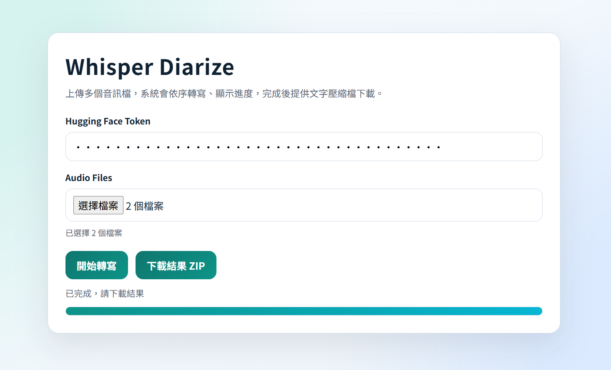
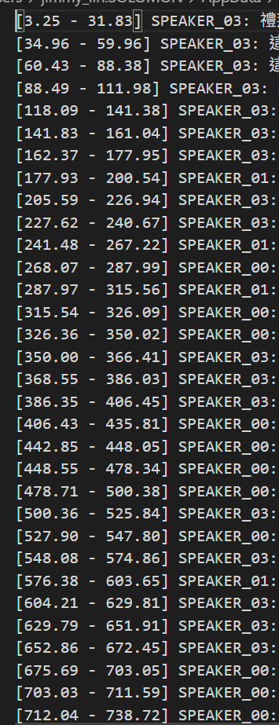

# Whisper Diarize Web Service

將**音檔**轉成帶有**時間戳、講者分離**的**文字檔**
(支援同時處理多個音檔)




範例結果:



### GPU 建議規格
- 最低建議：`8 GB VRAM`

### 驅動與 CUDA
- 需安裝可支援 CUDA 12.8 的 NVIDIA Driver
- 專案已鎖定 PyTorch CUDA 版本（`torch/torchaudio/torchvision +cu128`）

## 安裝與啟動
```powershell
cd C:\junxiang\project_evaluator\utils\whisper_diarize

修改以下檔案:
./venv/Lib/site-packages/pyannote/audio/core/pipeline.py Line102: token=use_auth_token, 
./venv/Lib/site-packages/pyannote/audio/core/model.py Line618: token=use_auth_token,

uv sync
uv run python app.py
```

啟動後開啟：`http://127.0.0.1:8134`

## Hugging Face Token
Diarization 需要 Hugging Face token，可用任一方式提供：
- 在網頁欄位填入 `Hugging Face Token`
- 或先設定環境變數 `HUGGINGFACE_TOKEN`
  